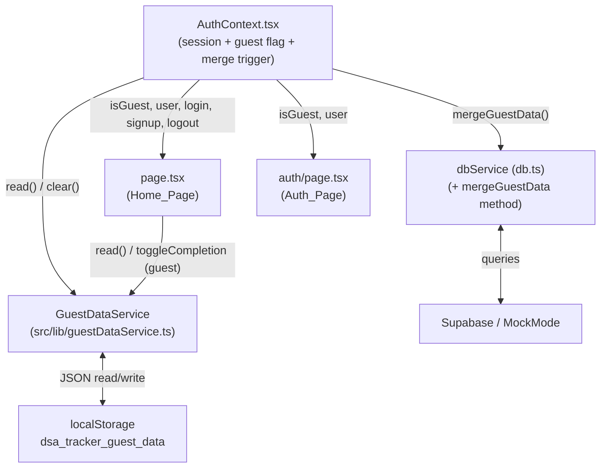
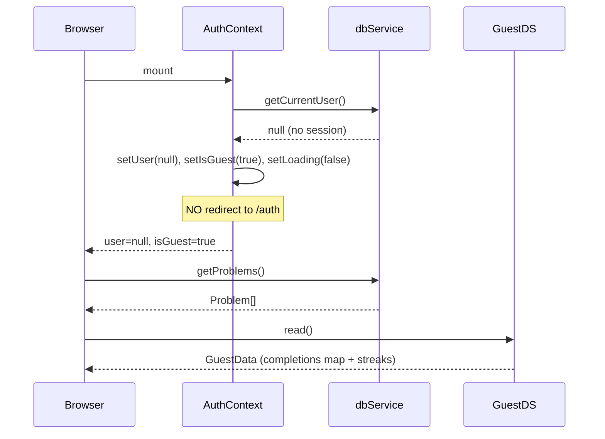
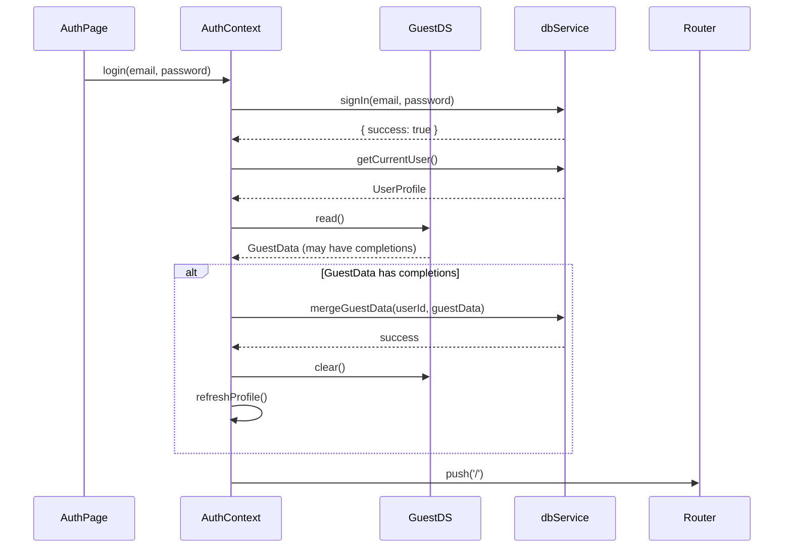

# Design Document: Guest Mode Auth

## Overview

This design introduces a "Guest Mode First" experience for the DSA Tracker. The current application hard-gates all content behind authentication — `AuthContext` immediately redirects unauthenticated visitors to `/auth`. This feature removes that wall.

The new flow: an unauthenticated visitor lands on the home page, views the full curriculum, and can track completions (stored in `localStorage`). When they choose to sign in or sign up, their guest progress is automatically merged into their account before navigation. The existing `AuthContext`, `db.ts`, and `page.tsx` are all modified; a new `GuestDataService` module handles isolated guest-state management.

**Key design decisions:**

- `isGuest` is a first-class boolean in `AuthContext` rather than derived from `user === null`, because `user === null` alone is ambiguous (it is also true during the initial loading phase).
- Guest data lives at a single well-known `localStorage` key (`dsa_tracker_guest_data`). It never uses the `dsa_mock_*` key namespace, which belongs exclusively to MockMode.
- The merge strategy is "server wins": if a guest completion and a server record share the same `problem_id`, the server record is preserved unchanged. This prevents guests from unintentionally backdating authenticated records.
- No new routes are introduced. The auth flow remains at `/auth`; the home page remains at `/`.

---

## Architecture

The feature spans four modules. Their relationships after this change:



**Loading lifecycle (guest):**



**Login + merge lifecycle:**



---

## Components and Interfaces

### GuestDataService (`src/lib/guestDataService.ts`)

A new pure client-side module. It never imports from Supabase and has no dependency on `dbService`.

```typescript
// Shape of the data stored at localStorage key: dsa_tracker_guest_data
export interface GuestData {
  max_streak: number;
  current_streak: number;
  completions: Record<string, string>; // problem_id -> ISO 8601 UTC timestamp
}

export const GuestDataService = {
  read(): GuestData | null;
  write(data: GuestData): void;
  clear(): void;
  addCompletion(problemId: string): void;
  removeCompletion(problemId: string): void;
};
```

**Implementation notes:**

- `read()` parses `localStorage.getItem('dsa_tracker_guest_data')`. Returns `null` if the key is absent or unparseable.
- `write()` calls `JSON.stringify` and `localStorage.setItem`. All writes to completions go through `write()`.
- `addCompletion(problemId)`: reads current data (or initialises a default), adds the entry, recalculates streaks using `calculateStreaks` from `db.ts`, then writes.
- `removeCompletion(problemId)`: same pattern but deletes the entry before recalculating.
- All `localStorage` calls are wrapped in `try/catch`. On failure the service falls back to an in-memory object (`let _memoryFallback: GuestData | null`) for the duration of the session. No exception is thrown to callers.
- `calculateStreaks` requires `UserCompletion[]`. The adapter maps `GuestData.completions` entries to the `UserCompletion` shape (`{ id: problemId, user_id: 'guest', problem_id: problemId, completed_at: timestamp }`).

### AuthContext changes (`src/context/AuthContext.tsx`)

**New exported field on `AuthContextType`:**

```typescript
isGuest: boolean;
```

**Initialization change:**

The `useEffect` that calls `refreshProfile()` currently redirects to `/auth` when no profile is found:

```typescript
// BEFORE
if (!profile && pathname !== '/auth') {
  router.push('/auth');
}

// AFTER — no redirect; set isGuest instead
if (!profile) {
  setIsGuest(true);
}
```

The Supabase `onAuthStateChange` handler remains unchanged for `SIGNED_IN`, `USER_UPDATED`, and `SIGNED_OUT` events. On `SIGNED_OUT`, `isGuest` is reset to `true` (user is back to guest state) and the router pushes to `/` rather than `/auth`.

**`login` and `signup` changes — post-auth merge hook:**

After a successful `signIn` or `signUp` resolves and `refreshProfile()` returns a valid `UserProfile`, both methods insert the following block before `router.push('/')`:

```typescript
const guestData = GuestDataService.read();
if (guestData && Object.keys(guestData.completions).length > 0) {
  try {
    await dbService.mergeGuestData(profile.id, guestData);
    GuestDataService.clear();
    await refreshProfile(); // pick up server-recalculated streaks
  } catch (err) {
    console.error('[guest-merge] merge failed, guest data preserved:', err);
    // Navigate anyway; guest data remains in localStorage for retry
  }
}
```

**`logout` change:**

After `signOut`, set `isGuest(true)` and push to `/` (not `/auth`).

### dbService changes (`src/lib/db.ts`)

**New method: `mergeGuestData`**

```typescript
async mergeGuestData(
  userId: string,
  guestData: GuestData
): Promise<{ success: boolean; error?: string }>
```

- Iterates over `Object.entries(guestData.completions)`.
- For each `[problemId, completedAt]`:
  - **Supabase path**: executes an upsert with `onConflict: 'user_id,problem_id'` and `ignoreDuplicates: true`. This is a single batch upsert for efficiency.
  - **MockMode path**: checks `dsa_mock_completions_<userId>` array, inserts only if `problem_id` is absent.
- After all insertions, recalculates streaks from the full completions list and updates the user profile (same pattern as `toggleCompletion`).
- Returns `{ success: true }` on completion, `{ success: false, error: message }` on failure.

**Supabase batch upsert:**

```typescript
const rows = Object.entries(guestData.completions).map(([problemId, completedAt]) => ({
  user_id: userId,
  problem_id: problemId,
  completed_at: completedAt,
}));

const { error } = await supabase
  .from('user_completions')
  .upsert(rows, { onConflict: 'user_id,problem_id', ignoreDuplicates: true });
```

`ignoreDuplicates: true` means existing rows (matched on the unique constraint `user_completions_user_id_problem_id_key`) are silently skipped — server wins.

### Home_Page changes (`src/app/page.tsx`)

**Auth guard change:**

```typescript
// BEFORE
useEffect(() => {
  if (!loading && !user) router.push('/auth');
}, [user, loading, router]);

// AFTER
useEffect(() => {
  // No redirect for guests — they are allowed on this page
}, []);
```

The existing redirect is removed entirely. Guest users see the full page.

**Data loading change:**

`loadData` currently requires a `userId`. For guest mode a new parallel path is added:

```typescript
useEffect(() => {
  if (user?.id) {
    loadData(user.id); // authenticated path (unchanged)
  } else if (isGuest) {
    loadGuestData();   // new guest path
  }
}, [user, isGuest]);
```

`loadGuestData` fetches problems from `dbService.getProblems()` (same call, no userId needed) and initialises the `completions` map from `GuestDataService.read()?.completions ?? {}`.

**Checkbox toggle for guests:**

```typescript
const handleCheckboxToggle = async (problemId: string) => {
  if (isGuest) {
    // Guest: optimistic update + localStorage write
    setCompletions(prev => ({ ...prev, [problemId]: true }));
    GuestDataService.addCompletion(problemId);
    // Reflect updated streaks from GuestDataService
    const updated = GuestDataService.read();
    if (updated) setGuestStreaks({ current: updated.current_streak, max: updated.max_streak });
    return;
  }
  // Authenticated: existing logic unchanged
  // ...
};
```

**Header rendering:**

```typescript
{isGuest ? (
  <button onClick={() => router.push('/auth')}>Sign In / Sign Up</button>
) : (
  <>
    {isAdmin && <button onClick={() => setShowAdminModal(true)}>Add Problem</button>}
    <button onClick={() => router.push('/profile')}>Profile</button>
    <button onClick={logout}>Logout</button>
  </>
)}
```

**Sidebar user bio card for guests:**

```typescript
const displayName = isGuest ? 'Guest' : user!.display_name;
const displayEmail = isGuest ? '' : user!.email;
const currentStreak = isGuest ? (GuestDataService.read()?.current_streak ?? 0) : user!.current_streak;
const maxStreak = isGuest ? (GuestDataService.read()?.max_streak ?? 0) : user!.max_streak;
```

To avoid repeated `localStorage` reads on every render, guest streak values are stored in a `guestStreaks` state object that is updated whenever `GuestDataService.addCompletion` or `removeCompletion` is called.

### Auth_Page changes (`src/app/auth/page.tsx`)

The existing redirect-if-logged-in `useEffect` is extended:

```typescript
useEffect(() => {
  if (user || isGuest) {
    router.push('/');
  }
}, [user, isGuest, router]);
```

Both an authenticated user and a guest are redirected away from `/auth` on mount. Guests who want to sign in must navigate there via the "Sign In / Sign Up" button from the home page, which does `router.push('/auth')`. The `isGuest` flag is set to `false` in `AuthContext` when the auth page is intentionally visited via that button — this is handled by passing a query parameter or by simply relying on the fact that `isGuest` remains `true` until a successful login, and the Auth_Page only redirects guests away on mount when `isGuest` is `true`. 

**Revised approach:** The redirect-guests-away-from-auth-page requirement (Req 1.5) is subtle. Since guests navigate to `/auth` by clicking the header button, the simplest correct implementation is: the `Auth_Page` redirects away only when `user !== null` (already authenticated). For guests, it does not redirect — otherwise the "Sign In / Sign Up" button would be useless. The requirement language ("WHEN Auth_Page mounts and user is null and isGuest is true, SHALL redirect to /") means guests who type `/auth` directly in the URL bar get redirected to `/` — the page is not meant to be a landing page. The button navigation works because clicking it is treated as an intentional opt-in.

**Implementation:** Use a `searchParams` or a context flag `guestAuthIntent` that the "Sign In / Sign Up" button sets before navigating. The simplest approach: add `?intent=signin` to the push URL from the header button, and the `Auth_Page` checks for it:

```typescript
// In Home_Page header button:
router.push('/auth?intent=signin');

// In Auth_Page:
const searchParams = useSearchParams();
const intentSignin = searchParams.get('intent') === 'signin';

useEffect(() => {
  if (user) {
    router.push('/');
  } else if (isGuest && !intentSignin) {
    // Guest navigated here directly (no intent param) — redirect back
    router.push('/');
  }
  // If isGuest && intentSignin: show the auth form normally
}, [user, isGuest, intentSignin, router]);
```

---

## Data Models

### GuestData (localStorage)

Stored at key `dsa_tracker_guest_data`:

```json
{
  "max_streak": 3,
  "current_streak": 1,
  "completions": {
    "mock-problem-1": "2025-01-15T09:30:00.000Z",
    "mock-problem-7": "2025-01-16T14:22:00.000Z"
  }
}
```

| Field | Type | Description |
|---|---|---|
| `max_streak` | `number` | Highest consecutive-day streak ever recorded for this guest |
| `current_streak` | `number` | Current consecutive-day streak as of last write |
| `completions` | `Record<string, string>` | Map of `problem_id` → ISO 8601 UTC timestamp of completion |

This shape is intentionally isomorphic to the server-side model so `calculateStreaks` can operate on it with a simple adapter.

### No schema changes

The existing `user_completions` table already has the unique constraint `user_completions_user_id_problem_id_key` which is exactly what Supabase's `onConflict` upsert relies on. No SQL migrations are required.

### AuthContext state additions

| Field | Type | Default | Description |
|---|---|---|---|
| `isGuest` | `boolean` | `false` | `true` when `loading` is `false` and `user` is `null` |

---

## Correctness Properties

*A property is a characteristic or behavior that should hold true across all valid executions of a system — essentially, a formal statement about what the system should do. Properties serve as the bridge between human-readable specifications and machine-verifiable correctness guarantees.*

### Property 1: GuestDataService round-trip

*For any* valid `GuestData` object (with any number of completions, and any non-negative streak values), calling `GuestDataService.write(data)` followed by `GuestDataService.read()` should return an object deeply equal to the original.

**Validates: Requirements 2.1**

---

### Property 2: Completion add/remove round-trip

*For any* non-empty `problem_id` string, calling `GuestDataService.addCompletion(problemId)` followed by `GuestDataService.removeCompletion(problemId)` should leave `GuestData.completions` in the same state it was in before either call.

**Validates: Requirements 2.2, 2.3**

---

### Property 3: Guest streak values agree with calculateStreaks

*For any* set of completion entries written to `GuestDataService`, the `current_streak` and `max_streak` fields returned by `GuestDataService.read()` should be exactly equal to the result of calling `calculateStreaks()` (from `db.ts`) on those same entries adapted to `UserCompletion[]` shape.

**Validates: Requirements 2.4, 5.1**

---

### Property 4: Home_Page renders all problems in guest mode

*For any* array of `Problem` objects returned by a mocked `dbService.getProblems()`, when the `Home_Page` is rendered with `isGuest=true`, the page should render exactly as many problem rows as the array contains (zero items shows the empty-state message).

**Validates: Requirements 1.2, 1.6**

---

### Property 5: Guest completions reflected in UI on mount

*For any* `completions` map stored in `GuestData` (with any subset of the curriculum's problem IDs), when the `Home_Page` mounts in guest mode, the checkboxes corresponding to those problem IDs should be rendered in the checked state.

**Validates: Requirements 2.5**

---

### Property 6: mergeGuestData upsert correctness

*For any* set of guest completion entries and *for any* pre-existing set of server completion records for the same user, after `dbService.mergeGuestData(userId, guestData)` completes:
1. Every problem ID that existed in the server records beforehand remains present and its `completed_at` timestamp is unchanged.
2. Every guest problem ID that did **not** exist in the server records beforehand is now present in the server records.
3. No additional records exist beyond the union of the above two sets.

**Validates: Requirements 4.4**

---

### Property 7: Sidebar streak display matches source data

*For any* `(current_streak, max_streak)` pair — whether sourced from `GuestDataService.read()` (guest mode) or from a `UserProfile` (authenticated mode) — the sidebar streak counters rendered in the `Home_Page` should display exactly those values.

**Validates: Requirements 3.4, 5.1, 5.2**

---

## Error Handling

### localStorage unavailability

`GuestDataService` wraps every `localStorage` call in `try/catch`. On the first caught exception, it switches to an in-memory fallback (`_memoryStore`) for the remainder of the session. All subsequent read/write operations use the in-memory store. Callers receive valid (possibly empty) data and never see an exception thrown.

This covers: private browsing with storage blocked, quota exceeded, and security policy restrictions.

### mergeGuestData failure

If `dbService.mergeGuestData` throws or returns `{ success: false }`, `AuthContext` logs the error to console with a `[guest-merge]` prefix and proceeds with `router.push('/')`. `GuestDataService.clear()` is **not** called, so guest data is preserved in `localStorage`. On the user's next login, the merge will be attempted again.

### Supabase upsert partial failure

The batch upsert in `mergeGuestData` is a single Supabase call. If it fails mid-batch (network error, RLS violation), the entire batch is rolled back by Supabase. The guest data is preserved for retry. No partial states are written.

### getProblems() returning empty in guest mode

`Home_Page` already renders an empty-state message when `problems.length === 0`. This path is identical for guests and authenticated users. No additional handling is needed.

### Auth_Page redirect loop prevention

The `?intent=signin` query parameter guards against infinite redirect loops. A guest who lands on `/auth` without the intent param is redirected to `/`. A guest who arrives via the header button (with `?intent=signin`) sees the auth form. After successful login, the `onAuthStateChange` handler fires, `isGuest` becomes `false`, `user` is set, and the form navigates to `/` — the intent param is no longer relevant.

---

## Testing Strategy

This feature combines UI rendering changes, state management logic, a new service class, and a database method. The testing approach mixes property-based tests for the core logic, and example-based tests for conditional rendering and sequencing behaviors.

### Property-Based Testing

The feature is well-suited for property-based testing in the pure-logic layer (`GuestDataService` and `dbService.mergeGuestData`). Use **fast-check** (TypeScript-native, well-maintained, works without a test runner plugin).

Install: `npm install --save-dev fast-check`

Each property test runs a minimum of 100 iterations. Tag format: `// Feature: guest-mode-auth, Property N: <description>`

**Property tests to implement:**

- **Property 1** (GuestDataService round-trip): Arbitrary generator for `GuestData` (arbitrary completions map with UUID-like keys and ISO timestamp values, non-negative integers for streaks). Assert `read(write(x)) == x`.
- **Property 2** (add/remove round-trip): Arbitrary string generator for `problemId`. Pre-populate GuestDataService with arbitrary initial completions. Assert that `addCompletion` then `removeCompletion` restores the original completions map.
- **Property 3** (streak agreement): Arbitrary array of completion timestamps. Assert `GuestDataService` stored streaks equal `calculateStreaks()` output.
- **Property 4** (Home_Page renders all problems): Arbitrary `Problem[]` arrays. Mock `dbService.getProblems()`. Assert rendered row count equals array length (or empty-state for length 0).
- **Property 5** (guest completions reflected on mount): Arbitrary `completions` map. Assert checked checkboxes match.
- **Property 6** (mergeGuestData upsert): Arbitrary guest completions and existing DB records (in MockMode to avoid Supabase calls). Assert all three post-conditions.
- **Property 7** (sidebar streak display): Arbitrary streak number pairs. Assert rendered text values match.

### Unit / Example Tests

Use **Jest** (or Vitest if preferred, both are compatible). These cover sequencing and conditional rendering cases:

- `AuthContext` initialises with `isGuest=true` when no session exists and does not call `router.push`.
- `Auth_Page` redirects authenticated user to `/`.
- `Auth_Page` redirects guest (no intent param) to `/`.
- `Auth_Page` does NOT redirect guest with `?intent=signin`.
- Header renders "Sign In / Sign Up" and hides Profile/Logout/Add Problem when `isGuest=true`.
- After successful login: `GuestDataService.read()` is called, then `mergeGuestData`, then `GuestDataService.clear()`, then `refreshProfile()`, then navigation.
- After successful login with no guest data: `mergeGuestData` is NOT called.
- After `mergeGuestData` throws: error is logged, navigation still occurs, `clear()` not called.
- After successful merge: `refreshProfile()` is called.

### Integration

The Supabase upsert path for `mergeGuestData` is tested with an actual Supabase test project (or `@supabase/test-helpers` mock), verifying:
- Duplicate `problem_id` rows are not created.
- The unique constraint is honoured.
- Streak values in `user_profiles` are updated correctly after merge.

These are run as a separate integration test suite with 2–3 representative examples, not as property-based tests.
